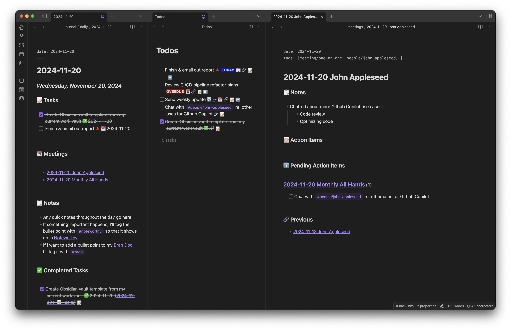

# My Obsidian Work Vault Template

*This README is best viewed within Obsidian.  Clone down the repo and open the Vault with Obsidian*

This is the template I use for my work Obsidian vaults.


## Workspace

Three panes, from left to right:

- **Todays note** - place to jot down any quick notes or random action items during the day
- **Todos** - permanently keeps [[Todos]] open
- **Note pane** - where other notes are edited (generally meeting notes)

*If the layout ever gets messed up, open up the Command Palette (`Cmd-K`) and run `Workspaces: Load Workspace layout` to reset it*

## Key bindings

- `Cmd-K` to open the command palette
- `Ctrl-Alt-~` - global hotkey to show/hide obsidian
## Workflows

#### Starting a new day

1. Put cursor in daily note (far left pane)
2. Run QuickAdd (`Cmd-K` -> `QuickAdd: Run QuickAdd`)
3. Select `Switch to Today`

This QuickAdd macro will unpin yesterday's note, switch to today, pin it.  The Rollover Daily Todos plugin will also move any unfinished todos

#### Tracking an action item / task / todo

Simply insert a `- [ ] ` anywhere in any note, it'll automatically show up on the [[Todos]] page.

Generally I will:

- add action items from emails/Slack messages to today's daily note
- add action items from meetings to that meeting's note

I use the Tasks plugin to add [due dates](https://publish.obsidian.md/tasks/Getting+Started/Dates) and [priorities](https://publish.obsidian.md/tasks/Getting+Started/Priority).

For recurring tasks, I add them [[Recurring Todos]]

#### Taking meeting notes

1. Run QuickAdd (`Cmd-K` -> `QuickAdd: Run QuickAdd`)
2. Select `New Meeting Notes`
3. Enter meeting name

This creates a new note `meetings/YYYY-MM-DD NAME` using the [[Meeting Template]].

For easy access, the meeting note will also automatically (via Dataview) show up on the daily note under the **📅 Meetings** heading.

#### Taking 1 on 1 notes

1. Run QuickAdd (`Cmd-K` -> `QuickAdd: Run QuickAdd`)
2. Select `New One-on-one Notes`
3. Enter person's name
4. Update YAML frontmatter to include a `#people/person-name` tag

This creates a new note `meetings/YYYY-MM-DD PERSON` using the [[One-on-one Template]]

The template is very similar to the meeting template, however it adds two sections powered by the `#people/person-name` tag in the frontmatter:

- **Pending Action Items** - shows all pending action items tagged with this person
- **Previous** - shows previous one-on-ones with this person

## Plugins

- [QuickAdd](https://github.com/chhoumann/quickadd) - Accessed via `Cmd-K` -> `QuickAdd: Run QuickAdd`, used to create new meeting notes & switch the daily note
- [Dataview](https://github.com/blacksmithgu/obsidian-dataview) - Used to generate most dynamic content, see [docs](https://blacksmithgu.github.io/obsidian-dataview/) for more info
- [Tasks](https://github.com/obsidian-tasks-group/obsidian-tasks) - Additional tasks/todos functionality - due dates, recurring, etc.  See [docs](https://publish.obsidian.md/tasks/Introduction) for more info
- [Filename Heading Sync](https://github.com/dvcrn/obsidian-filename-heading-sync) - Keeps filename in sync with the `# Heading 1` in a file - renaming file changes Markdown heading and vice versa
- [Rollover Daily Todos](https://github.com/lumoe/obsidian-rollover-daily-todos) - Automatically moves unfinished todos from yesterday's daily note to today's daily note
- [Completr](https://github.com/tth05/obsidian-completr) - Autocomplete for tags in YAML frontmatter (disabled elsewhere)
- [Global Hot Keys](https://github.com/mjessome/obsidian-global-hotkeys) - Powers the system-wide `Ctrl-Alt-~` hotkey to show/hide Obsidian
- [Auto Link Title](https://github.com/zolrath/obsidian-auto-link-title) - Converts bare URLs into nice Markdown links.  Activated via command palette, i.e. `Cmd-K` -> search `Auto Link Title`
- [Periodic Notes](https://github.com/liamcain/obsidian-periodic-notes) - Adds support for monthly, quarterly, yearly notes.  Activated via command palette, i.e. `Cmd-K` -> search `Periodic Notes`

## Important Files

- [[Todos]] - aggregates pending todo items across all notes
- [[Recurring Todos]] - generic recurring todos live here
- Tag powered files:
	- [[Brag Doc]] - my brag doc (see [Julia Evan's article](https://jvns.ca/blog/brag-documents/)), powered by all bullet points tagged with `#brag` 
	- [[Kudos]] - any time I want to remember something awesome a coworker did, I tag the bullet point with `#kudos` `#people/john-appleseed`  and it shows up here
	- [[Noteworthy]] - anything tagged with `#noteworthy` shows up here, generally it's important info I want to share at a later date (standup, all hands meeting, etc.)
- Templates:
	- [[Daily Template]] - template for daily note
	- [[Meeting Template]] - template for meetings
	- [[One-on-one Template]] - template for 1 on 1 meetings

## Folder Structure

```
├── Brag Doc.md
├── Kudos.md
├── Noteworthy.md
├── README.md
├── Recurring Todos.md
├── Todos.md
├── journal
│   ├── daily
│   │   └── 2024-11-20.md
│   ├── monthly
│   │   └── 2024-11.md
│   └── quarterly
│       └── 2024-Q4.md
├── meetings
│   ├── 2024-11-13 John Appleseed.md
│   ├── 2024-11-20 John Appleseed.md
│   └── 2024-11-20 Monthly All Hands.md
├── notes
│   └── Marketing Ideas.md
├── projects
│   └── CI CD Pipeline Refactor.md
└── templates
    ├── Daily Template.md
    ├── Engineering Manager Interview Template.md
    ├── Meeting Template.md
    ├── Monthly Template.md
    ├── One-on-one Template.md
    └── Quarterly Template.md
```

### Folders

- `journal/` - daily, monthly, etc. notes live here
- `meetings/` - meeting notes live here, title is always prefixed by current date
- `notes/` - random notes go here
- `projects/` - each project I'm involved in will have a note here
- `templates/` - all note templates go here (leveraged by built-in daily notes, QuickAdd, and Periodic Notes plugins)
